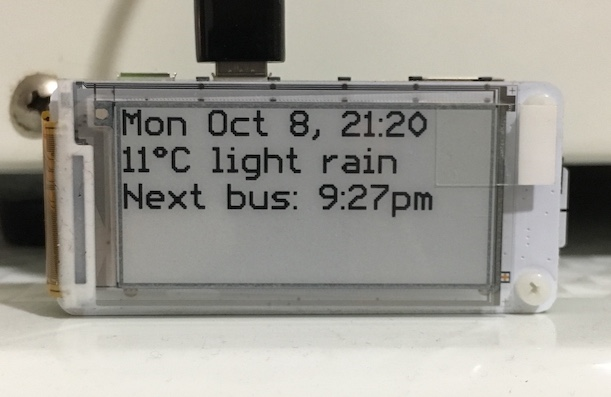

# display-weather
Various Python scripts to run on a Raspberry Pi Zero with a [Papirus Zero LCD display](https://www.adafruit.com/product/3335).

Scripts:
 - [display_weather.py] - displays current weather conditions and next bus time on Papirus ePaper LCD display.

