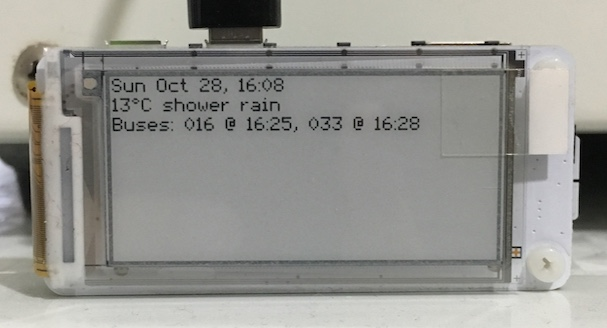

# display-weather
Various Python scripts to run on a Raspberry Pi Zero with a [Papirus Zero LCD display](https://www.adafruit.com/product/3335).

**`display_weather.py`**

Scripts:
 - [display_weather.py](display_weather.py) - displays current weather conditions and next bus time on Papirus ePaper LCD display.

Modules:
 - [current_weather.py](current_weather.py) - acquires current weather information from [openweathermap.org](https://openweathermap.org)
 - [bus_times.py](bus_times.py) - acquires next bus departure times from [Translink's API](https://developer.translink.ca/ServicesRtti/ApiReference)
 - [bitmaps.py](bitmaps.py) - low-res character bitmaps specially designed for low-res displays.  For more details see my [bitmaps](https://github.com/billtubbs/text-bitmaps) repository.
